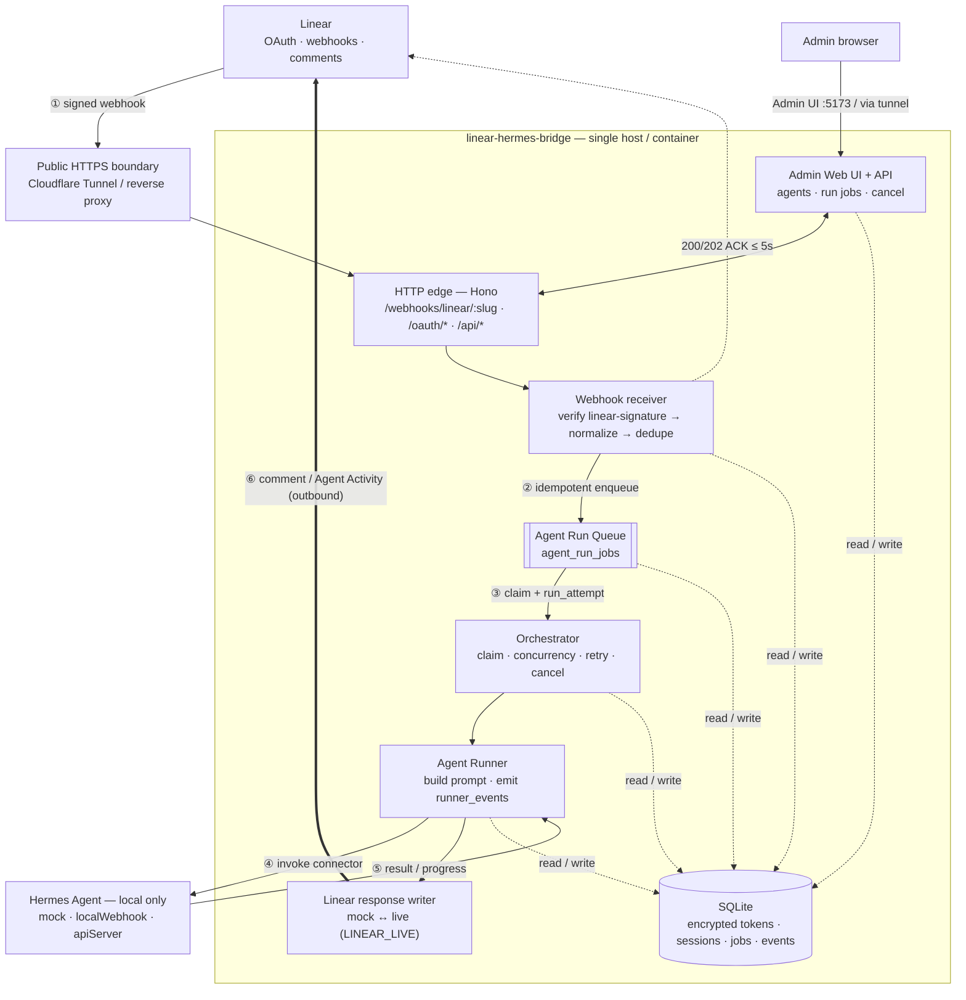
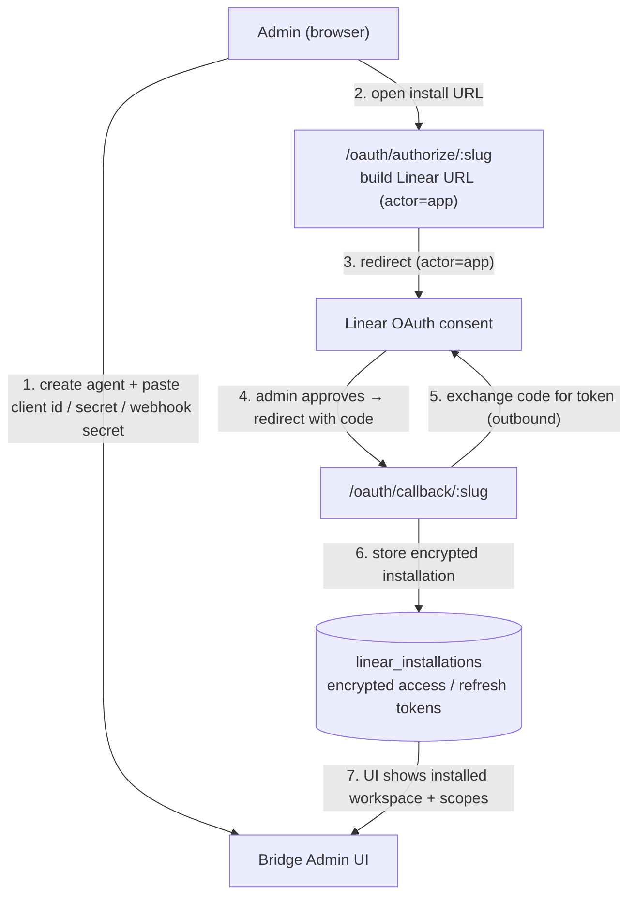

# Linear Hermes Bridge

Self-hosted Linear Agent bridge for Hermes Agent. It lets a homelab user install one or more Linear OAuth `actor=app` agents, expose only OAuth/webhook/Web UI endpoints through a public tunnel, and route Linear mentions/delegations to local Hermes agents or profiles.

## MVP in one sentence

Run a Docker Compose stack that receives Linear Agent webhooks over a Cloudflare Tunnel (or equivalent), maps each Linear app/user to a local Hermes agent/profile, sends instructions to Hermes over a local-only connection, and returns results to Linear as comments or Agent Activity.

## Core requirements

1. **Homelab-friendly Docker deployment** — `docker compose up -d`, persistent local volume, SQLite by default.
2. **Public tunnel boundary** — public OAuth/webhook/Web UI address via Cloudflare Tunnel/ngrok/Tailscale Funnel; Hermes itself remains private and local-only.
3. **Multi-agent routing** — one bridge instance can manage many Linear OAuth apps and route each to a separate Hermes profile, endpoint, or command policy.
4. **TypeScript-first stack** — bridge service, Agent Run Queue, Agent Runner, Web UI, and Linear integration should be implemented primarily in TypeScript.

## Quick start for self-hosters

### 1. Prepare an environment file

Create `.env` from the example and fill the required secrets:

```bash
cp .env.example .env
openssl rand -base64 32   # use as ENCRYPTION_KEY
openssl rand -hex 32      # use as APP_SECRET
```

Minimum local values:

```dotenv
PUBLIC_BASE_URL=https://linear-bridge.example.com
PORT=8787
HOST=0.0.0.0
DATABASE_URL=file:/app/data/bridge.db
ENCRYPTION_KEY=<32-byte-base64-secret>
APP_SECRET=<at-least-16-chars>
LINEAR_LIVE=false
LOG_LEVEL=info
```

Notes:

- `PUBLIC_BASE_URL` must be the public HTTPS URL Linear can call through your tunnel.
- `ENCRYPTION_KEY` encrypts OAuth tokens at rest. Keep it stable; changing it makes stored tokens unreadable.
- `LINEAR_LIVE=false` keeps the bridge in mock writer mode for local smoke tests. Set `LINEAR_LIVE=true` only after Linear OAuth credentials and callbacks are configured.
- The bridge runs database migrations automatically on startup.

### 2. Run with Docker Compose

For local builds from this repository:

```bash
docker compose up -d --build
curl http://127.0.0.1:8787/healthz
```

For a self-hosted server that pulls the published GitHub Container Registry image, use this compose file:

```yaml
services:
  bridge:
    image: ghcr.io/hojinzs/linear-hermes-bridge:latest
    container_name: linear-hermes-bridge
    restart: unless-stopped
    ports:
      - "8787:8787"
    env_file:
      - .env
    environment:
      HOST: 0.0.0.0
      DATABASE_URL: file:/app/data/bridge.db
    volumes:
      - ./data:/app/data
    healthcheck:
      test: ["CMD", "node", "-e", "fetch('http://127.0.0.1:8787/healthz').then(r=>process.exit(r.ok?0:1)).catch(()=>process.exit(1))"]
      interval: 30s
      timeout: 5s
      retries: 3
      start_period: 15s
```

Then run:

```bash
docker compose pull
docker compose up -d
```

The image is published as `ghcr.io/hojinzs/linear-hermes-bridge:latest` when changes land on `main`. SHA-pinned tags are also available as `ghcr.io/hojinzs/linear-hermes-bridge:sha-<commit>`.

### 3. Expose only the bridge

Point your public tunnel to the bridge HTTP port, not to Hermes Agent itself:

```text
Linear / Browser
  -> https://linear-bridge.example.com
  -> tunnel provider
  -> localhost:8787 on your homelab server
  -> local-only Hermes endpoint/connector
```

Use the public URL as your Linear OAuth callback/webhook base URL.

## Direct local execution

Use this path for development or for a single-machine self-host install without Docker.

```bash
pnpm install --frozen-lockfile
cp .env.example .env
# edit .env; for direct local execution DATABASE_URL=file:./data/bridge.db is fine
pnpm --filter @lhb/bridge run db:migrate
pnpm --filter @lhb/bridge run build
node apps/bridge/dist/index.js
```

For iterative development with the repository defaults:

```bash
pnpm dev
```

Health check:

```bash
curl http://127.0.0.1:8787/healthz
```

## Docker image publishing

This repository includes a GitHub Actions workflow that publishes the Docker image to GitHub Container Registry only on pushes to `main`:

- Workflow: `.github/workflows/docker-ghcr.yml`
- Registry: `ghcr.io`
- Image: `ghcr.io/hojinzs/linear-hermes-bridge`
- Tags: `latest` and `sha-<commit>`

The workflow uses the built-in `GITHUB_TOKEN` with `packages: write` permission, so no extra registry secret is required for the repository owner. If the package is private, self-host users must authenticate before pulling:

```bash
echo <github-token-with-read:packages> | docker login ghcr.io -u <github-user> --password-stdin
```

## Proposed stack

| Layer | MVP choice | Notes |
| --- | --- | --- |
| Runtime | Node.js 22 + TypeScript | Familiar, Docker-friendly, good Linear SDK support. |
| HTTP server | Hono on Node.js | Lightweight HTTP server for self-hosted Node. |
| Web UI | React + Vite | Lightweight admin UI for agent registry and install status. |
| Database | SQLite + Drizzle ORM | Homelab-friendly single-file persistence. |
| Agent execution | In-process Agent Run Queue + Agent Runner first, BullMQ optional later | Webhooks must ACK quickly; Hermes execution should happen async. Keep Worker Process as deployment terminology only. |
| Tunnel | Cloudflare Tunnel documented, alternatives allowed | Bridge receives public traffic; Hermes does not. |
| Hermes connection | Local HTTP API/webhook first | Keep Hermes private on localhost/LAN. |

## High-level flow

### Runtime — a Linear mention or delegation, end to end



The bridge **ACKs the webhook within ~5s** (②) and runs the Hermes work
asynchronously (③–⑥). Hermes is never exposed publicly — only the bridge is
reachable through the tunnel, and the connector reaches Hermes over
localhost/LAN. A duplicate webhook delivery is dropped by the dedupe key at ②,
and a cancel request flips the job to `canceled` between ③ and ⑥.

### OAuth install — one-time, per agent



Internal decomposition (Agent Run Queue → Orchestrator → Agent Runner → Hermes connector) is described in [`docs/architecture.md`](docs/architecture.md).

## Documentation map

- [`docs/architecture.md`](docs/architecture.md) — components, data flow, sequence diagrams.
- [`docs/deployment.md`](docs/deployment.md) — Docker Compose, tunnel, and local Hermes connectivity.
- [`docs/linear-setup.md`](docs/linear-setup.md) — manual Linear OAuth app setup and smoke test.
- [`docs/api-contracts.md`](docs/api-contracts.md) — MVP HTTP route contracts and payload shapes.
- [`docs/security.md`](docs/security.md) — auth, signatures, token storage, human approval boundaries.
- [`docs/implementation-plan.md`](docs/implementation-plan.md) — TypeScript implementation phases and tasks.
- [`docs/open-decisions.md`](docs/open-decisions.md) — decisions Steve should make before build.
- [`docs/review-log.md`](docs/review-log.md) — five review passes performed before initial commit.
- [`docs/smoke-test.md`](docs/smoke-test.md) — local and Docker smoke-test runbook.
